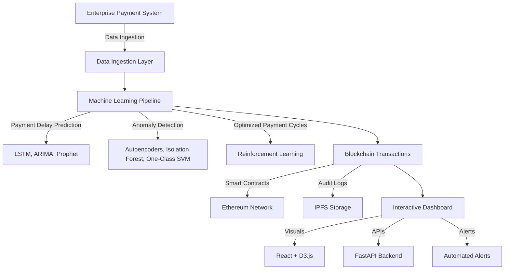

# AI-Driven Secure Payment Prediction and Anomaly Detection  

**Real-time machine learning and blockchain-powered system to predict payment delays, detect fraud, and secure vendor transactions.**  

## Table of Contents  
- [Overview](#overview)  
- [Features](#features)  
- [Architecture](#architecture)  
- [Tech Stack](#tech-stack)  
- [Setup & Installation](#setup--installation)  
- [Usage](#usage)  
- [API Endpoints](#api-endpoints)  
- [Contributing](#contributing)  
- [License](#license)  

---

## Overview  
Businesses struggle with **payment delays** due to cash flow issues, policy constraints, and fraudulent activities. This project:  
✅ Uses **Machine Learning (LSTM, ARIMA, Prophet)** to **predict payment delays**  
✅ Detects **anomalous transactions** (fraud detection) using **Autoencoders, Isolation Forest, One-Class SVM**  
✅ Secures vendor payments with **Ethereum smart contracts**  
✅ Provides a **React-based dashboard** for real-time insights  

---

## Features  
- **Real-time payment delay prediction**  
- **Anomaly detection for fraudulent transactions**  
- **Blockchain-based vendor payment security**  
- **Role-based dashboard for monitoring**  
- **Automated alerts for suspicious activity**  

---

## Architecture  
The system consists of three major components:  



---

## Tech Stack  

| Layer                 | Technology        |
|----------------------|----------------|
| **Backend**          | FastAPI (Python) |
| **Machine Learning** | TensorFlow, Scikit-learn, Prophet |
| **Blockchain**       | Ethereum, Solidity, IPFS |
| **Database**         | PostgreSQL + MongoDB |
| **Frontend**        | React + D3.js |
| **Infrastructure**   | Docker, Kubernetes, AWS (S3, Lambda, SageMaker) |

---

## Setup & Installation  

### 1. Clone the Repository  
```sh
git clone https://github.com/your-username/ai-payment-prediction.git  
cd ai-payment-prediction
```

### 2️. Set Up Python Virtual Environment  
```sh
python -m venv venv  
source venv/bin/activate  # For Mac/Linux  
venv\Scripts\activate  # For Windows  
```

### 3️. Install Dependencies  
```sh
pip install -r requirements.txt
```

### 4️. Start the Backend API  
```sh
uvicorn app.main:app --reload
```

### 5️. Start the Frontend (React)  
```sh
cd frontend  
npm install  
npm start  
```

---

## API Endpoints  

| Method | Endpoint | Description |
|--------|----------|-------------|
| `POST` | `/predict-delay` | Predicts payment delay based on transaction history |
| `POST` | `/detect-anomaly` | Detects fraudulent transactions |
| `GET`  | `/blockchain-status` | Fetches blockchain transaction details |

---

## Contributing  
Contributions are welcome! To contribute:  
1. Fork the repo  
2. Create a feature branch (`git checkout -b feature-name`)  
3. Commit your changes (`git commit -m "Added new feature"`)  
4. Push to the branch (`git push origin feature-name`)  
5. Create a Pull Request  

---

## License  
This project is licensed under the *Apache License 2.0** – see the [LICENSE](https://github.com/gauravksingh-16/vendor-payment-analytics/blob/main/LICENSE) file for details.  

---

### Next Steps  
✅ Deploy smart contracts to Ethereum Mainnet  
✅ Optimize ML models for real-time performance  
✅ Add support for multi-cloud deployment  

---

## Contact  
For questions, contact **[Gaurav Kumar Singh]** at `gauravkumarsingh3360@gmail.com`.  
